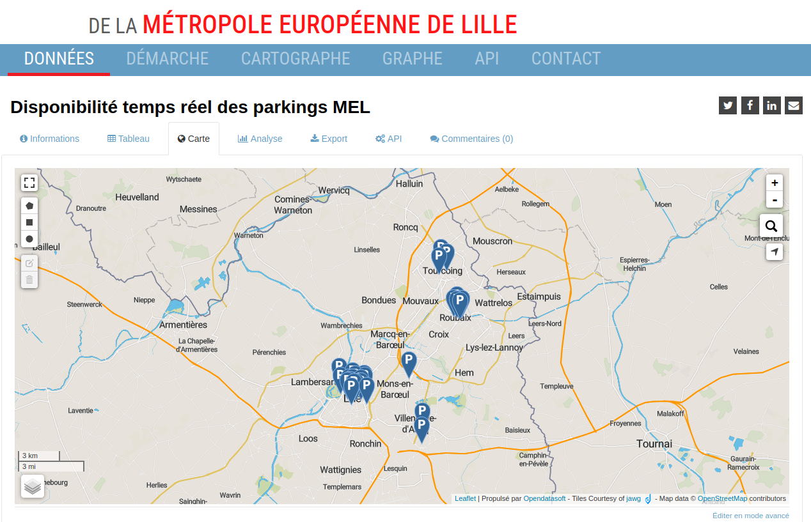
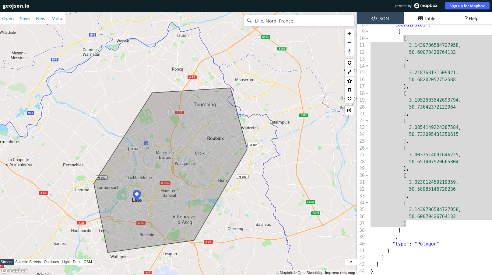

# park-king
Marre de tourner en rond à la recherche de places ? :car: :parking:  

Cette API REST regroupe plusieurs sources de données de différentes villes, afin de faciliter la recherche d'un parking.

L'API est modulaire : l'intégration de nouvelles villes se fait par l'ajout de `connecteurs`.

Une fois le projet lancé, la documentation peut être consultée à l'adresse suivante : http://localhost:8080/swagger-ui.html

La collection [Postman](https://www.postman.com/) est disponible dans le dossier `/assets`.

## Objectifs

- Lister les parking d'un maximum de villes, les parkings à proximité d'un point (ex : position de l'utilisateur, adresse)
- Retourner le nombre de places, et les places libres en "temps réel" (si disponibles) d'un parking
- Pour chaque ville, exposer les données des parking sous un format de réponse standard et commun : plus facile à intégrer pour un client
- Developper-friendly : faciliter la maintenance, et l'ajout de nouvelles villes via des `connecteurs`

## Structure du projet

### Modèle de données

Le projet est paramétré à travers une seule table `City` qui recense les différentes villes intégrées dans l'API. 

Je me suis inspiré du principe de [CityMapper](https://citymapper.com/), c'est à dire compartimenter les données par ville.

En effet, pour des raisons de performance, et de navigation, nous ne pouvons pas afficher les données parking de toutes les villes à la fois.
Qu'importe le client (application mobile, site web), celui-ci devra demander à l'utilisateur de choisir une ville, ou de se baser sur la position actuelle de l'utilisateur pour laisser l'API déterminer la ville.

Table `City`

| Colonne       | Type      |
| --------------|---------- |
| code (PK)     | varchar   |
| label         | varchar   |
| polygonArea   | polygon   |
| isDisabled    | bit       |
| connector     | varchar   |

Colonnes : 
- `label` : le libellé de la ville
- `polygonArea` : permet de déterminer via un polygone la zone couverte par la ville. Cela permet notamment à un client de demander la ville correspondant à une position géographique. Concrètement, une application mobile peut demander à l'utilisateur sa position ou bien le laisser chercher une adresse. L'application mobile nous fournirait les coordonnées (latitude, longitude et distance), et l'API pourrait déterminer de quelle ville il s'agit. Une fois la ville déterminée, on saurait quel connecteur (c'est à dire quelles sources de données requêter)
- `isDisabled` : permet de ne plus faire remonter une ville, pratique en cas de maintenance ou d'indisponibilité des données
- `connector` : le nom du `connecteur` à utiliser

Un exemple de paramétrage en base de données pour la ville de Poitiers :

| code  | label | polygonArea | isDisabled | connector |
| ----- | ----- | ----------- |-----|------------------|
| poitiers | Poitiers | POLYGON ((0.29368210308794573 46.56978644438371, 0.3065647832412708 46.55731866234689, 0.3331188927708979 46.55560681994356, 0.3629922659933129 46.56321459505472, 0.3723968464515508 46.5818491359758, 0.354970712072855 46.60408811112782, 0.31460849231839916 46.60186362267095, 0.29466816331336076 46.5840955120762, 0.29368210308794573 46.56978644438371)) | 0 | poitiers-connector |

### Modules du projet

Le projet est structuré sous forme de modules Maven. Cette architecture n-tiers a été choisie pour faciliter la maintenance et l'expérience développeur en déléguant à chaque module une responsabilité particulière. Cela permet également de mettre en place des tests par module (intégration pour la couche webservice, JUnit pour la couche service).

```
|
|_parkking-cities-api                  <= Module principal de l'API Parkking
|   |_parkking-webservice       <= Couche web (controllers)
|   |_parkking-db               <= Couche persistence
|   |_parkking-service          <= Couche business, qui utilise les connecteurs
|
|_parkking-cities-connector     <= Module pour les connecteurs de villes
   |_common-connector    <= Interface, dto, utilitaires communs
   |_[city-A]-connector
   |_[city-B]-connector
   ...
```

**Notes :**
- Le module API :
   - Reçoit la requête du client. Détermine quel `connecteur` utiliser, l'utilise pour récupérer les parking de la ville selon la requête, retourne les données standardisée au client. C'est l'interface entre le client et les connecteurs
   - Est divisée en n-tiers couches : webservice, service, db
- L'API utilise ce qu'on appelle ici des `connecteurs` pour récupérer les données parking des différentes villes
- La couche API et les connecteurs sont 2 modules à part. En effet, l'API utilise les connecteurs comme source de données. On peut considérer que les connecteurs forment une librairie interne au projet


### Connecteurs
Chaque ville dans l'API fait l'objet d'un connecteur. Un connecteur est chargé de récupérer les données parking d'une ville depuis une/plusieurs sources de données, et de les exposer dans une structure standardisée. Le module API utilise ensuite ces données pour les exposer au client.

L'idée est de proposer une structure modulaire :
- Les connecteurs implémentent un contrat d'interface commun : ils prennent en paramètres les même input, et retournent en sortie les mêmes output
- Les modules peuvent être ajoutés, désactivés (par exemple avec l'utilisation de profiles sous Maven), supprimés facilement. Cela permet d'ajouter des villes plus facilement, ou bien de décommissionner / migrer également une ville sans impacter les autres villes
- 1 ville = 1 connecteur : facilite la maintenance, on sait où naviguer pour maintenir un composant

:point_right: Aujourd'hui, le projet contient **2 villes / connecteurs** : Poitiers et Roubaix.


### Ajouter une nouvelle ville

Etapes pour ajouter une ville (on va prendre l'exemple de Lille) : 

1. Créer un nouveau module Maven dans le projet `parkking-cities-connector`
2. S'assurer qu'il est bien listé en tant que module Maven dans le pom.xml de `parkking-cities-connector`
3. Déclarer ce nouveau module en tant que dépendance dans le pom.xml du module `parkking-service` du projet `parkking-cities-api`
4. Créer un service annoté `@Service` dans le nouveau module, et s'assurer de rajouter un nom au service dans l'annotation, ex : `@Service("lille-connector")`. Ce sera le nom du connecteur à lier à une ville en base de données. Ce service devra implémenter l'interface `CityParkingConnector`
5. Créer une ligne dans la table `City`, et renseigner le nom du connecteur, ici `lille-connector` dans la colonne `connector`

Pour créer le polygon correspondant à la ville de Lille, je consulte la [carte des parking](https://opendata.lillemetropole.fr/explore/dataset/disponibilite-parkings/map/?location=11,50.66506,3.11548&basemap=jawg.streets) de la ville de Lilles qu'ils mettent à disposition : 



Pour tracer le Polygon, j'utilise [geojson.io](https://geojson.io), qui me permet ensuite d'exporter les différents points : 



Je les ajoute ensuite dans la colonne `polygonArea` de la table `City`.

## Choix techniques

### Idée initiale

Après avoir observé les jeux de données de plusieurs villes Françaises, j'ai constaté que la plupart se trouvent se trouvent sur Opendata, c'est à dire au format JSON via une API REST.

J'ai pensé utiliser une table générique permettant de paramétrer pour chaque ville la manière de récupérer et parser ces données. Pour cela, on pourrait paramétrer une expression [JsonPath](https://goessner.net/articles/JsonPath/) pour chaque propriété qu'on souhaite récupérer dans Opendata.

Table `City`

| Colonne       | Type      |
| --------------|---------- |
| code (PK)     | varchar   |
| label         | varchar   |
| polygonArea   | polygon   |
| isDisabled    | bit       |

Table `Datasource`
| Colonne       | Type      |
| --------------|---------- |
| id (PK)     | int   |
| city_id (FK)         | bit   |
| isDisabled         | bit   |
| url   | varchar   |
| parsing_method (ex: jsonPath|xPath) | varchar |
| parsing_name_expr | varchar |
| parsing_capacity_expr | varchar |
| parsing_latlng_expr | varchar |
| parsing_remaining_expr | varchar |

Si cela permettrait de mettre en place rapidement de nouvelles villes disposant de données via une API Opendata, cela se complique si on doit gérer d'autres sources et format de données. En effet, certaines villes n'ont pas d'API, mais mettent à disposition les données sous forme de fichier JSON, GEOJSON, CSV, etc. Dans ce cas, il faudrait soit les ajouter en tant que fichier plat, soit les insérer dans une base de données (par exemple pour faciliter la recherche par coordonnées geo).

Ce modèle a donc des limites : 
- Trop générique : compliqué à débugger car le code serait le même pour toutes les villes
- Limité au format JSON. Pour pouvoir gérer d'autres format et type de données, il faudrait réadapter le modèle
- Maintenance plus complexe car pas de séparation pour chaque ville, tout le paramétrage serait en base de données

### Projet actuel

Pour des soucis de maintenabilité et de clarté, quitte à avoir de la redondance, j'ai opté pour la solution actuelle sous forme de modules/connecteurs. Chaque module a sa propre responsabilité.

J'ai fais également les choix suivants :
- Intégration de 2 villes pour l'instant : Poitiers et Roubaix afin de montrer l'utilisation des connecteurs
- N'étant pas connaisseur, j'utilise la latitude + longitude + distance (mètres) par défaut pour rechercher les parking à proximité car ce sont les critères utilisés par Opendata
- Ajout d'Hibernate spatial, notamment pour gérer les polygones des villes. Pour les villes ne disposant que de fichiers plats, on pourrait rajouter les parking en base de données avec leur coordonnées et faciliter la recherche par rapport à un point avec Hibernate
- H2, pour le développement plutôt qu'une base de données persistente

## Pistes d'amélioration

Ce que j'aurai mis en place dans un contexte pro et avec un peu plus de temps et de pratique :
- Plus de JUnit, aujourd'hui seul le module parkking-service est couvert
- Des tests d'intégration pour les modules parkking-webservice et pour les connecteurs
- Profile Maven pour chaque module de connecteur, permettant de ne pas les inclure dans le build au lieu de commenter le code (ex: CVE, maintenance)

## Ce que j'ai pu apprendre
- La patience, surtout pour configurer hibernate-spatial et h2 avec h2gis
- Le multimodule avec Maven
- Pleins de choses théoriques sur les systèmes géographiques, cartes : polygon, hibernate-spatial, etc.
